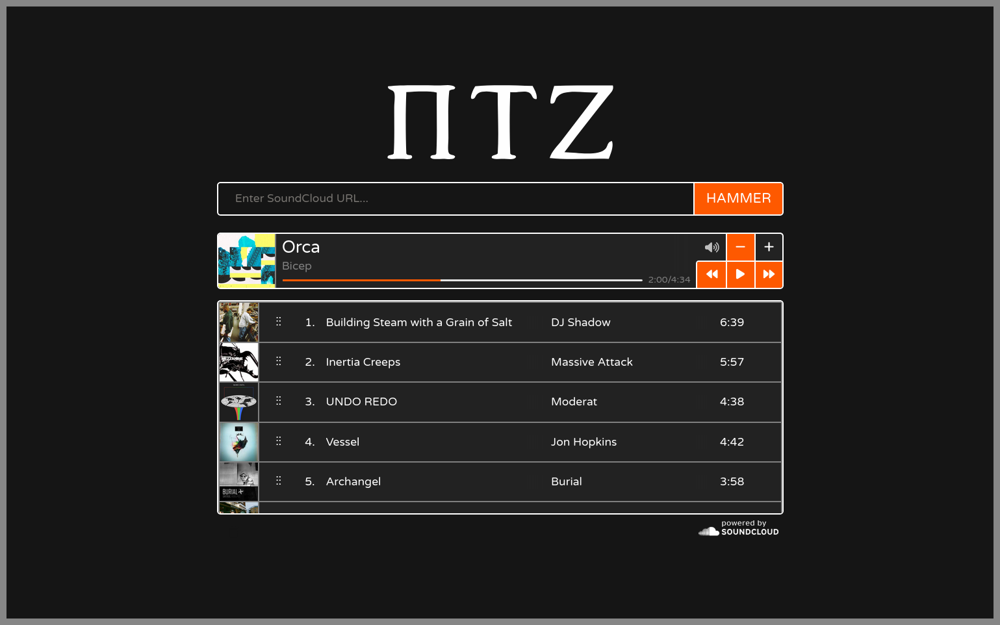

<h1 align="center">
Trackhammer
</h1>

Trackhammer is a system for blasting tunes on East Campus 2W, written with React and Node.js. Anyone can visit the website and submit a SoundCloud link (including SoundCloud Go+ tracks). Trackhammer will add the song to the queue. Users can play, pause, skip, adjust the volume, and reorder the queue all from the website.

Heavily inspired by <a href="https://github.com/zbanks/musicazoo">Musicazoo</a>.

---
## Code Overview:
The goal of this section is to outline the bones of this project so that people who do a lil coding but don't know diddly squat about this kind of project can take a crack at maintaining it in the future.

The frontend is written with React. There are four main components:
- App-Header (PTZ Logo)
- Song-Entry (Text box + button)
- Player (Currently playing song info + buttons)
- Queue (List of upcoming songs)

To maintain a snappy interface and minimize the feeling of latency, each component keeps track of its own state clientside.
[Socket.io](https://socket.io/) is used to synchronize all clients with the most recent queue from the server.
Any change that the user makes is immediately reflected locally.
The client then broadcasts the change to the server, which updates its own state to reflect the change.
The server then broadcasts its state to all clients, which update their state to reflect the server's.

The one exception to this is when songs are added to the queue - the client queue will not update to reflect the new song until it has received the track information from the server - I didn't want to implement the SoundCloud API in the client lmao.

The backend is just Node.js and Socket.io (with a teeny bit of express). Fundamentally the server receives a request from the client and then does something. The action happens in the `sockets/` folder. There are only a few ways that the client interacts with the server:
- `queue.js`
	- Add a song to the queue
	- Remove a song from the queue
	- Reorder the queue
- `player.js`
	- Increase the volume
	- Decrease the volume
	- Mute/unmute
	- Skip current song
	- Restart current song
	- Pause/play

Whenever a client requests some sort of change on the server, the server broadcasts relevant states to all clients which sync to the server's state.
Only the currently playing song and the progress through that song are broadcast independent of any client request.
The backend implementation of the SoundCloud API is \[NOT WRITTEN AS OF 6/16\].

---
Written by James Randall (MIT '28 EECS & STS).

This is my first web dev project, so I'm sure there's a lot I did wrong.
I don't really gaf though, Putz is a doacracy so if you have a problem PULL REQUEST THAT SHIT!
My CSS in particular is really messy and like doesn't follow convention at all because I was learning web dev and react at the same time I was writing it.
Maybe one day it will be fixed ¯\\_(ツ)_/¯
